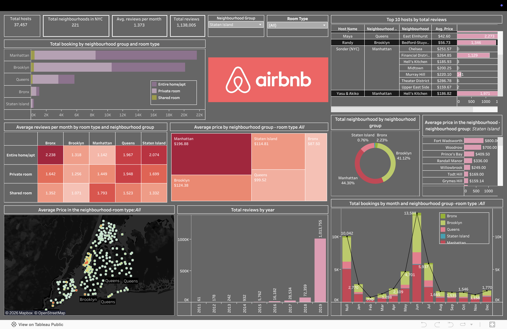

# Airbnb NYC Dashboard (Tableau)

An interactive Tableau dashboard analyzing the Airbnb New York City 2019 dataset.

This project explores listing distribution, pricing patterns, room type preferences, and neighborhood-level trends to help understand the NYC short-term rental market.

## Live Dashboard

View on Tableau Public: [Open Interactive Dashboard](https://public.tableau.com/app/profile/aryan.kinha/viz/Airbnb_17771925304230/Dashboard1)

<!-- [](https://public.tableau.com/app/profile/aryan.kinha/viz/Airbnb_17771925304230/Dashboard1) -->
## Dashboard Preview



## Project Structure

```text
Airbnb_Dashboard/
├── README.md
├── dashboard/
│   └── Airbnb.twbx
├── dataset/
│   └── AB_NYC_2019.csv
└── screenshots/
		└── overview.png
```

## Dataset

- **Source file:** `dataset/AB_NYC_2019.csv`
- **Geography:** New York City
- **Snapshot year:** 2019
- **Main fields used:**
	- Neighborhood group / neighborhood
	- Room type
	- Price
	- Minimum nights
	- Number of reviews
	- Availability (365)

## Key Analysis Areas

- Distribution of listings across boroughs and neighborhoods
- Price variation by room type and location
- Relationship between review activity and listing behavior
- Availability trends across listing categories

## Tools Used

- Tableau (dashboard design and interactive visual analytics)
- CSV dataset for source data

## How to Open Locally

1. Install Tableau Desktop (or Tableau Public Desktop).
2. Open `dashboard/Airbnb.twbx`.
3. If prompted, reconnect the data source to `dataset/AB_NYC_2019.csv`.
4. Explore the interactive dashboard using filters and tooltips.

## Dashboard Highlights

- Clear overview of NYC Airbnb market distribution
- Interactive filtering for deeper borough-level analysis
- Comparative view of room types and price behavior
- Visual storytelling focused on business-relevant insights

## Author

Created by Divyanshu Singh.
